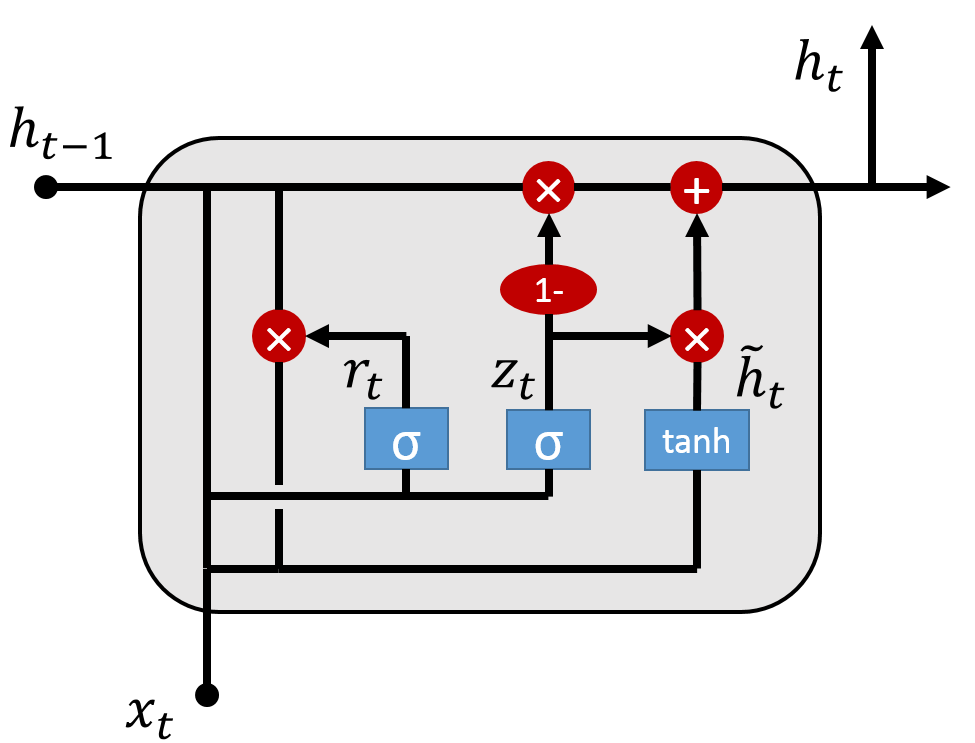

# Machine Learning
## System Identification with LSTM networks

**Long short-term memory (LSTM)** is an artificial recurrent neural network (RNN) architecture used in the field of deep learning. Unlike standard feedforward neural networks, LSTM has feedback connections. It can not only process single data points (such as images), but also entire sequences of data (such as speech or video). For example, LSTM is applicable to tasks such as unsegmented, connected handwriting recognition or speech recognition. There are several architectures of LSTM units. A common architecture is composed of a cell (the memory part of the LSTM unit) and three "regulators", usually called gates, of the flow of information inside the LSTM unit: an input gate, an output gate and a forget gate. Some variations of the LSTM unit do not have one or more of these gates or maybe have other gates. For example, gated recurrent units (GRUs) do not have an output gate. *-from wikipedia.org*  
 
*GRU Cell Structure*  

 
 

The field of ***system identification*** uses statistical methods to build mathematical models of dynamical systems from measured data. System identification also includes the optimal design of experiments for efficiently generating informative data for fitting such models as well as model reduction. *-from wikipedia.org*  

For this work, **Spring-Mass-Damper System** is selected for model and **Deep GRU Network** is selected for system identification.
System identification result is shown in the Figure:  

